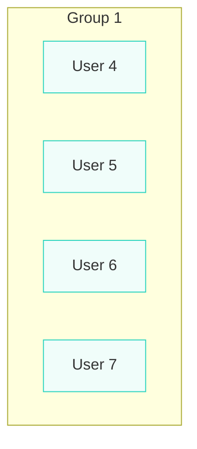

A webapp that users can login to and view or modify reservations based on their authority.

Frontend - Javascript
Backend - Java
Database - Postgre (runnable with Docker)

Sensetive information is kept in a secret.env file, which is in a directory above both front-end and back-end, so it is necesary to set that up in order to run localy :) the file
should look something like this:

DB_USERNAME=your_username
DB_PASSWORD=your_password
DB_NAME=db_name
DB_PORT=5432

The docker compose file will not register the file, unless it's in the same folder, so you need to use this command before running the app, so that the path gets set correctly:

docker compose --env-file ../secret.env up -d

This gets run from the destination of the docker compose file, which is in the back-end (Java) app folder. If you run the app before the setup, the compose file will build
it with the wrong path and there won't be any warning, except that the variables don't exist :( it's annoying, but I havn't found a way to set it up, and I'm getting frustrated. 

Backend: 

You can check the APIs with swagger

asd
