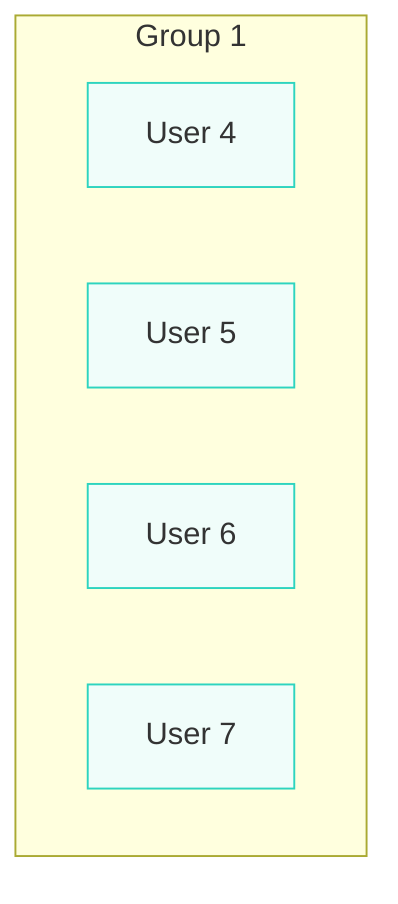
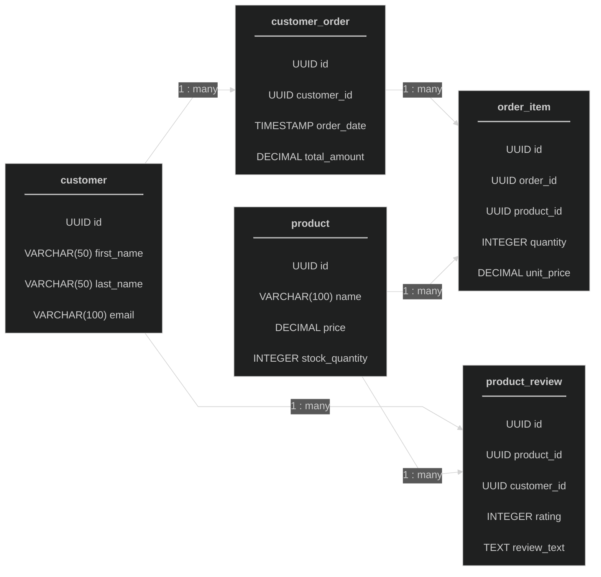
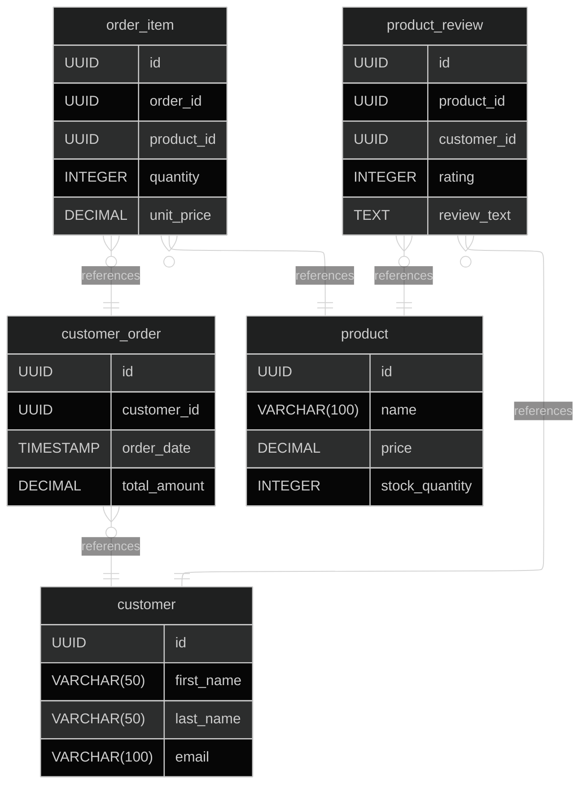

A webapp that users can login to and view or modify reservations based on their authority.

Frontend - Javascript
Backend - Java
Database - Postgre (runnable with Docker)

Sensetive information is kept in a secret.env file, which is in a directory above both front-end and back-end, so it is necesary to set that up in order to run localy :) the file
should look something like this:

DB_USERNAME=your_username
DB_PASSWORD=your_password
DB_NAME=db_name
DB_PORT=5432

The docker compose file will not register the file, unless it's in the same folder, so you need to use this command before running the app, so that the path gets set correctly:

docker compose --env-file ../secret.env up -d

Backend: 

You can check the APIs with swagger

