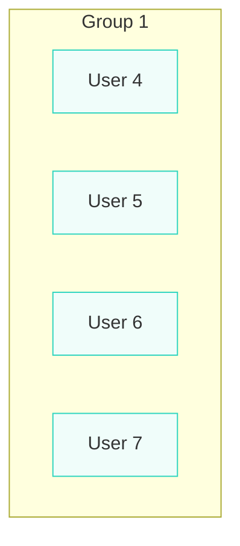

A webapp that users can login to and view or modify reservations based on their authority.

Frontend - Javascript
Backend - Java
Database - Postgre (runnable with Docker)

Sensetive information is kept in a secret.env file, which is in a directory above both front-end and back-end, so it is necesary to set that up in order to run localy :) the file
should look something like this:

DB_USERNAME=your_username
DB_PASSWORD=your_password
DB_NAME=db_name
DB_PORT=5432

The docker compose file will not register the file, unless it's in the same folder, so you need to use this command before running the app, so that the path gets set correctly:

docker compose --env-file ../secret.env up -d

This gets run from the destination of the docker compose file, which is in the back-end (Java) app folder. If you run the app before the setup, the compose file will build
it with the wrong path and there won't be any warning, except that the variables don't exist :( it's annoying, but I havn't found a way to set it up, and I'm getting frustrated. 

Backend: 

You can check the APIs with swagger

asd

<svg width="128" height="128" viewBox="0 0 128 128" fill="black" xmlns="http://www.w3.org/2000/svg">
<path d="M56.7937 84.9688C44.4187 83.4688 35.7 74.5625 35.7 63.0313C35.7 58.3438 37.3875 53.2813 40.2 49.9063C38.9812 46.8125 39.1687 40.25 40.575 37.5313C44.325 37.0625 49.3875 39.0313 52.3875 41.75C55.95 40.625 59.7 40.0625 64.2937 40.0625C68.8875 40.0625 72.6375 40.625 76.0125 41.6563C78.9187 39.0313 84.075 37.0625 87.825 37.5313C89.1375 40.0625 89.325 46.625 88.1062 49.8125C91.1062 53.375 92.7 58.1563 92.7 63.0313C92.7 74.5625 83.9812 83.2813 71.4187 84.875C74.6062 86.9375 76.7625 91.4375 76.7625 96.5938L76.7625 106.344C76.7625 109.156 79.1062 110.75 81.9187 109.625C98.8875 103.156 112.2 86.1875 112.2 65.1875C112.2 38.6563 90.6375 17 64.1062 17C37.575 17 16.2 38.6562 16.2 65.1875C16.2 86 29.4187 103.25 47.2312 109.719C49.7625 110.656 52.2 108.969 52.2 106.438L52.2 98.9375C50.8875 99.5 49.2 99.875 47.7 99.875C41.5125 99.875 37.8562 96.5 35.2312 90.2188C34.2 87.6875 33.075 86.1875 30.9187 85.9063C29.7937 85.8125 29.4187 85.3438 29.4187 84.7813C29.4187 83.6563 31.2937 82.8125 33.1687 82.8125C35.8875 82.8125 38.2312 84.5 40.6687 87.9688C42.5437 90.6875 44.5125 91.9063 46.8562 91.9063C49.2 91.9063 50.7 91.0625 52.8562 88.9063C54.45 87.3125 55.6687 85.9063 56.7937 84.9688Z" fill="black"/>
</svg>

