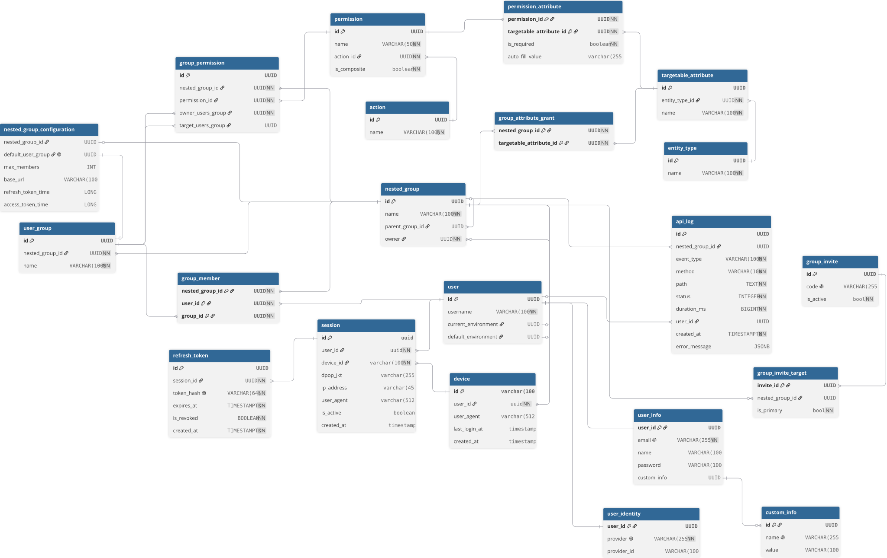
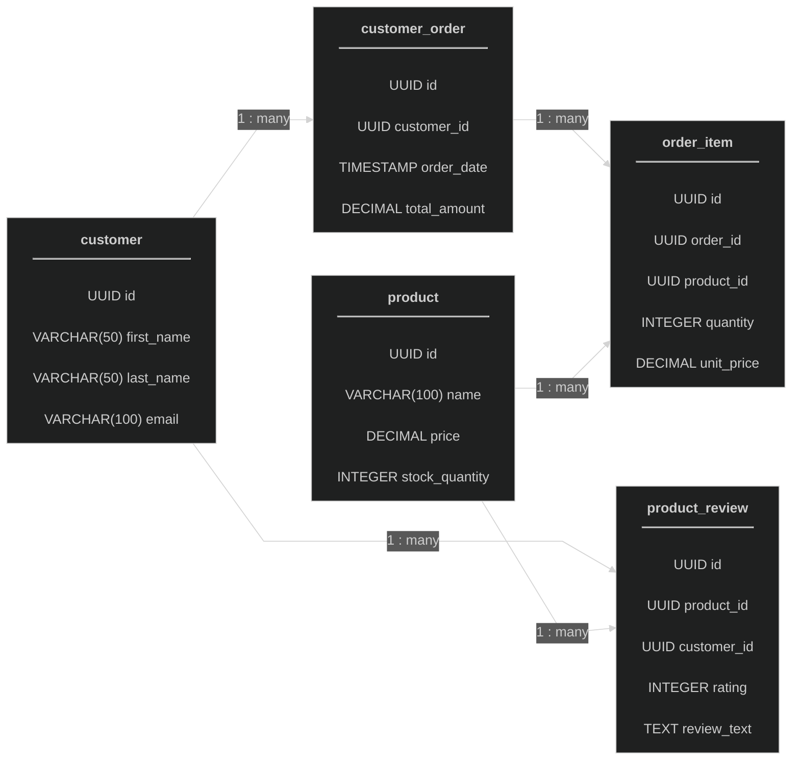
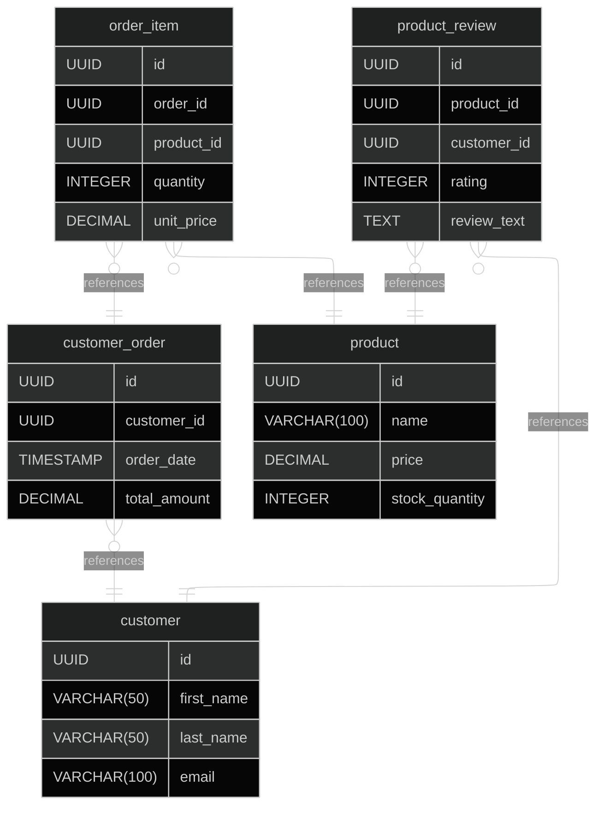

Introduction

Welcome to my humble web app, which is used to establish and verify Authorization and Authentication.

Frontend - JavaScript
Backend - Java, Postgre (runnable with Docker)

Sensitive information is kept in a secret.env file, which is in a directory above both front-end and back-end. Often, the Java IDE won't register the file, so it's necasary to add it in the project setup to run locally. For production, names of the enviroment variables should then be named the same as it is in the file. Usually, the database hosting service generates some key value, so it is good to start with that first. I use [neon](https://neon.com/) for the database hosting, because they offer a free hosting service, it does however take a little while upon the initial query to wake up, so when you want to log-in/register, you'll have to wait a few seconds. To host the back-end server I use google cloud which is also for free, but I find the platform quite chaotic and hard to navigate. For the setup on google I use the [cloud build file](cloudbuild.yaml), the API endpoints that my front-end uses to communicate with the back-end can be found [here](https://amazing-api-460348586740.europe-central2.run.app/swagger-ui/index.html). Lastly, the front-end which is done in plain JavaScript is hosted on [Vercel](https://vercel.com/), a super cool and easy to use platform for hosting my JavaScript app.

> Interactive version: [dbdiagram.io](https://dbdiagram.io/d/6a55e2ccc3a90dd98d2de2ba)

```mermaid
%%{init: {"theme":"dark","flowchart":{"curve":"linear"}}}%%

flowchart LR

customer["<b>customer</b><hr/>
UUID id<br/>
VARCHAR(50) first_name<br/>
VARCHAR(50) last_name<br/>
VARCHAR(100) email"]

product["<b>product</b><hr/>
UUID id<br/>
VARCHAR(100) name<br/>
DECIMAL price<br/>
INTEGER stock_quantity"]

customer_order["<b>customer_order</b><hr/>
UUID id<br/>
UUID customer_id<br/>
TIMESTAMP order_date<br/>
DECIMAL total_amount"]

order_item["<b>order_item</b><hr/>
UUID id<br/>
UUID order_id<br/>
UUID product_id<br/>
INTEGER quantity<br/>
DECIMAL unit_price"]

product_review["<b>product_review</b><hr/>
UUID id<br/>
UUID product_id<br/>
UUID customer_id<br/>
INTEGER rating<br/>
TEXT review_text"]

customer -->|"1 : many"| customer_order
customer_order -->|"1 : many"| order_item
product -->|"1 : many"| order_item
customer -->|"1 : many"| product_review
product -->|"1 : many"| product_review
```

```mermaid
---
config:
  layout: elk
  theme: dark
---
erDiagram
	direction TB
	customer_order {
		UUID id  ""  
		UUID customer_id  ""  
		TIMESTAMP order_date  ""  
		DECIMAL total_amount  ""  
	}

	customer {
		UUID id  ""  
		VARCHAR(50) first_name  ""  
		VARCHAR(50) last_name  ""  
		VARCHAR(100) email  ""  
	}

	order_item {
		UUID id  ""  
		UUID order_id  ""  
		UUID product_id  ""  
		INTEGER quantity  ""  
		DECIMAL unit_price  ""  
	}

	product {
		UUID id  ""  
		VARCHAR(100) name  ""  
		DECIMAL price  ""  
		INTEGER stock_quantity  ""  
	}

	product_review {
		UUID id  ""  
		UUID product_id  ""  
		UUID customer_id  ""  
		INTEGER rating  ""  
		TEXT review_text  ""  
	}

	customer_order}o--||customer:"references"
	order_item}o--||customer_order:"references"
	order_item}o--||product:"references"
	product_review}o--||product:"references"
	product_review}o--||customer:"references"
```

